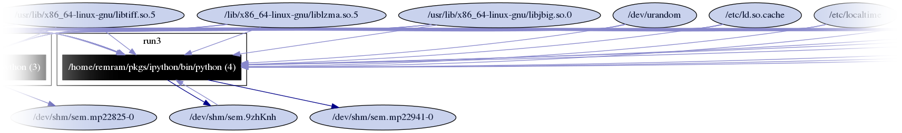
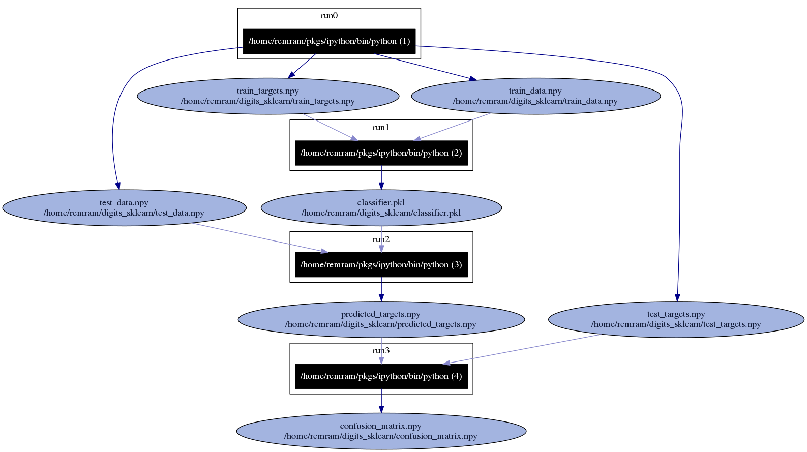
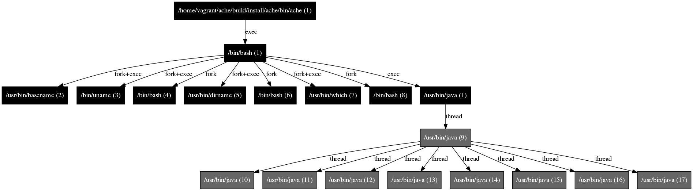

..  _graph:

Visualizing the Provenance Graph
********************************

..  note:: If you are using a Python version older than 2.7.3, this feature will not be available due to `Python bug 13676 <http://bugs.python.org/issue13676>`__ related to sqlite3.

To generate a *provenance graph* related to the experiment execution, the ``reprounzip graph`` command should be used::

    $ reprounzip graph graphfile.dot mypackfile.rpz

where `graphfile.dot` corresponds to the graph, and `mypackfile.rpz` corresponds to the experiment package.

Alternatively, you can use this after running ``reprozip trace`` without creating a ``.rpz`` package by using::

    $ reprounzip graph [-d tracedirectory] graphfile.dot

The graph is outputted in the `DOT <http://en.wikipedia.org/wiki/DOT_(graph_description_language)>`__ language. You can use `Graphviz <http://www.graphviz.org/>`__ to load and visualize the graph::

    $ dot -Tpng graphfile.dot -o graph.png

It is also possible to output a JSON file with the flag ``--json``.

Command-Line Options
====================

Since an experiment may involve a significantly large number of file dependencies, ``reprounzip graph`` offers several command-line options to control what will be shown in the provenance graph, as described below. By default, it includes all information available, which is often unreadable (see :numref:`fig-toobig`).

Filtering Out Files
+++++++++++++++++++

Files can be filtered out using a regular expression [#re]_ with the flag ``--regex-filter``. For example:

* ``--regex-filter /~[^/]*$``` will filter out files whose name begins with a tilde
* ``--regex-filter ^/usr/share`` will filter out ``/usr/share`` recursively
* ``--regex-filter \.bin$`` will filter out files with a ``.bin`` extension

These flags can be passed multiple times.

Replacing Filenames
+++++++++++++++++++

Users can remap filenames using regular expressions [#re]_ with the flag ``--regex-replace``. This can be useful to:

* simplify the graph by making filenames shorter,
* aggregate multiple files to a single node by mapping them to the same name, or
* fix programs that are using some type of cache or for which the wrong access was logged, such as Python's ``.pyc`` files.

Example:

* ``--regex-replace .pyc$ \.py`` will replace accesses to bytecode cache files (.pyc) to the original source (.py)
* ``--regex-replace ^/dev(/.*)?$ /dev`` will aggregate all device files as a single path `/dev`
* ``--regex-replace ^/home/vagrant/experiment/data/(.*)\.bin data:\1`` will simplify the paths to some data files

The flag ``--aggregate`` is a shortcut allowing users to aggregate all files beginning with a given prefix. For instance, ``--aggregate /usr/somepath`` will collapse all files under ``/usr/somepath`` (this is equivalent to ``--regex-replace '^/usr/somepath' '/usr/somepath'``).

Both flags can be passed multiple times.

Controlling Levels of Detail
++++++++++++++++++++++++++++

Users can control the levels of detail for each category of items in the provenance graph.

Software Packages
.................

* ``--packages file`` will show all the files belonging to a package grouped under that package's name
* ``--packages package`` will show the package as a single item, not detailing the individual files that it contains
* ``--packages drop`` will entirely hide the packages, removing all their files from the graph
* ``--packages ignore`` will ignore the package identification, handling their files as if they had not been detected as being part of a package

Note that regex filters and replacements are applied beforehand, so files that are remapped to a package will be shown under that package name.

Processes
.........

* ``--processes thread`` will show every process and thread
* ``--processes process`` will show every process and hide threads
* ``--processes run`` will show only one node for an experiment run, even if the run is composed by multiple processes and threads

Other Files
...........

For files that are not part of a software package, or if ``--packages ignore`` is being used:

* ``--otherfiles all`` will show every file (unless filtered by ``--regex-filter``)
* ``--otherfiles io`` will show only the input and output files, as identified in the configuration file
* ``--otherfiles no`` will ignore all the files

..  [#re] Anchoring regular expressions with ``^`` and ``$`` and escaping dots (``\.``) is recommended. For more information about regular expressions, please see `here <https://en.wikipedia.org/wiki/Regular_expression>`__.

Common Recipes
==============

* Full provenance graph (likely to be unreadable for most experiments, due to the large amount of information to be presented)::

    $ reprounzip graph graph.dot myexperiment.rpz

.. _fig-toobig:



    Provenance graph showing all the information available (full graph). This represents the default configuration.

* Mapping Python bytecode cache files to their corresponding source file (this may help attribute file accesses to software packages)::

    $ reprounzip graph --regex-replace '\.pyc$' '\.py' graph.dot myexperiment.rpz

* Dataflow of the experiment, showing the runs and their corresponding input and output files::

    $ reprounzip graph --packages drop --otherfiles io --processes run graph.dot myexperiment.rpz

.. _fig-digits-io:



    Provenance graph showing input and output files for an experiment with 4 runs.

* Provenance graph showing only processes and threads (no file accesses)::

    $ reprounzip graph --packages drop --otherfiles drop --processes thread graph.dot myexperiment.rpz

.. _fig-processes:



    Provenance graph showing only processes and threads.
