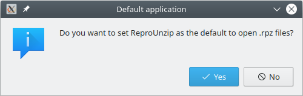
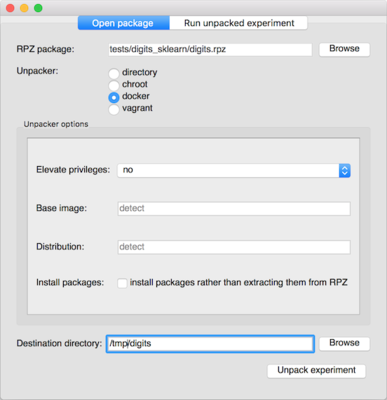
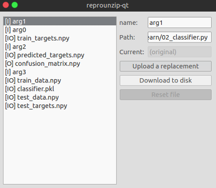

..  _unpacking-gui:

ReproUnzip GUI
**************

**reprounzip-qt** is a graphical interface (GUI) for reprounzip, allowing you to unpack and reproduce experiments from ``.rpz`` files without having to use the command-line. You can also set it as the default handler for the ``.rpz`` file extension so you can open them via double-click.

Installation
============

*reprounzip-qt* comes with the installer on `Windows <http://reprozip-files.s3-website-us-east-1.amazonaws.com/windows-installer>`_ and `Mac <http://reprozip-files.s3-website-us-east-1.amazonaws.com/mac-installer>`_. If you used one of these, you will be able to double click on any ``.rpz`` file to boot up the GUI.

If you are using Anaconda, you can install *reprounzip-qt* from anaconda.org::

    $ conda install --channel vida-nyu reprounzip-qt

Otherwise, you will need to `install PyQt5 <https://www.riverbankcomputing.com/software/pyqt/download5>`__ (or `PyQt4 <https://www.riverbankcomputing.com/software/pyqt/download>`__) before you can install *reprounzip-qt* from pip (on Debian or Ubuntu, you can use ``apt-get install pyqt5-dev``).

On Linux, you will need to run the application one time so that it registers
itself as the handler for ``.rpz`` files.

Usage
=====

The first tab in the window that appears is for you to set up the experiment. This will allow you to choose which `unpacker <unpacking.html#unpackers>`_ you'd like to use to reproduce the experiment, and in which directory you'd like to unpack it.

After successfully unpacking, you'll be prompted to run the experiment in the second tab. You can choose which run you want to execute, though the default is to have all runs selected. ReproUnzip will detect the order of the runs and reproduce the experiment accordingly.

..  image:: figures/reprounzip-qt-1.png

Clicking "Manage Files" will bring up options to download the input and output data of the original experiment, and upload your own data to use it in the same experiment. You'll notice input files are marked ``[I]`` and output files are marked ``[O]``. ``[IO]`` are both input and output files.

