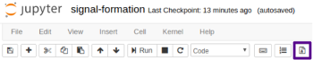
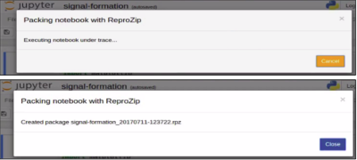
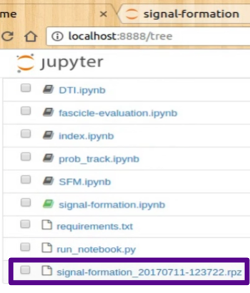
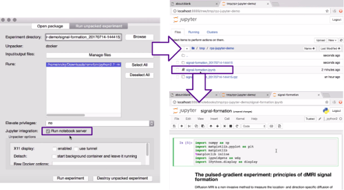

..  _reprozip-jupyter:

Making Jupyter Notebooks Reproducible with ReproZip
***************************************************

**reprozip-jupyter** is a plugin for `Jupyter Notebooks <https://jupyter.org>`, a popular open-source web application that allows you to create and share documents that contain live code, equations, visualizations and narrative text. These are valuable documents for data cleaning, analysis, writing executable papers/articles, and more. However, Jupyter Notebooks are subject to dependency hell like any other application -- just the Notebook is not enough for full reproducibility. We have written a ReproZip plugin for Jupyter Notebooks to help users automatically capture dependencies (including data, environmental variables, etc.) of Notebooks and also automatically set up those dependencies in another computing environment.

Installation
============
You can install *reprozip-jupyter* with pip::

	  $ pip install reprozip-jupyter

Or Anaconda::

		$ conda install reprozip-jupyter
	  
Once successfully installed, you should then enable the plugin for both the client and server side of Jupyter Notebooks::
		
		$ jupyter nbextension install --py reprozip_jupyter --user
		$ jupyter nbextension enable --py reprozip_jupyter --user
		$ jupyter serverextension enable --py reprozip_jupyter --user

Once these steps are completed, you should either start a Jupyter Notebook server and/or restart your kernel to be able to see the ReproZip button in your notebook's toolbar. 

Packing
============
Once you have a notebook that executes the way you want, you can trace and pack all the dependencies, data, and provenance with *reprozip-jupyter* by simply clicking the button on the notebook's toolbar:

The notebook will execute from top-to-bottom and *reprozip-jupyter* traces that execution. If there are no errors in the execution, you'll see two pop-ups like this one after the other:

*reprozip-jupyter* will name the resulting ReproZip package (*.rpz*) as *notebookname_datetime.rpz* and save it to the same working directory the notebook is in:

Unpacking
============
Now, anyone can rerun the Jupyter notebook, with all dependencies automatically configured. First, they would need to install *reprounzip* and the *reprounzip-docker* plugin (installation steps are in the unpacking seciton of the documentation). Second, they need to download or otherwise acquire the *.rpz* file and original *.ipynb* notebook they'd like to reproduce.

To reproduce the notebook using the GUI, follow these steps:

1. Double-click the .rpz file.
2. The first tab in the window that appears is for you to set up how you'd like ReproUnzip to unpack and configure the contents of the *.rpz*. Choose docker as your unpacker, and choose the directory you'd like to unpack into.
3. Make sure the Jupyter Integration is checked, and click Run experiment:

.. image:: figures/rzj-setup.png

4. This second table allows you to interact with and rerun the notebook. All you need to do is click 'Run Experiment' and the Jupyter Notebook home file list should pop up in your default browser (if not, navigate to localhost:8888). Open the notebook, and rerun with every dependency configured for you!

On the command line, you would::

1. Set up the experiment using *reprounzip-docker*::

		$ reprounzip docker setup <package.rpz> <directory>
		
2. Rerun the notebook using *reprozip-jupyter*::

		$ reprozip-jupyter run <directory>
		
3. The Jupyter Notebook home file list should pop up in your default browser (if not, navigate to localhost:8888). 
4. Open the notebook, and rerun with every dependency configured for you!

