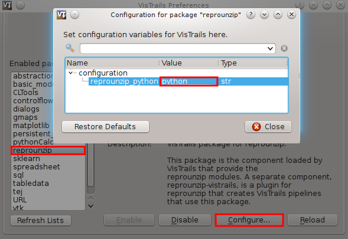
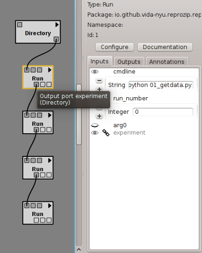

..  _vistrails:

VisTrails Plugin
****************

The `reprounzip-vistrails` plugin is a component that interacts with the existing unpackers to generate and execute a `VisTrails <https://www.vistrails.org/>`__ workflow from the packed experiment. By using VisTrails, you can better manage the experiment workflow: it allows you to run unpacked ReproZip experiments, replace input files, visualize and retrieve output files, and modify the dataflow to re-use steps of the original experiment. For more information about VisTrails, please see their `user's guide <https://www.vistrails.org/index.php/Users_Guide>`__.

..  note:: This plugin is **not** distributed with `reprounzip`; it is a separate component that should be installed beforehand (see :ref:`install` for more details).

Once the plugin is installed, a VisTrails workflow will be generated every time you unpack an experiment; note that this process does not require VisTrails. The workflow file is named ``vistrails.vt`` and is generated under the unpacked directory.

VisTrails Setup
===============

To run the workflow, you need VisTrails installed on your machine and the reprounzip package, which is included in VisTrails 2.2.3 and up. If you used an installer for either VisTrails or *reprounzip*, you need to set the path to reprounzip's Python interpreter in VisTrails's package configuration dialog:

For example, this will be ``/opt/reprounzip/python27/bin/python`` if you used the Mac OS X installer, and something similar to ``C:\Program Files (x86)\ReproUnzip\python2.7\python.exe`` if you used the Windows installer.

Usage
=====

The workflow generated by `reprounzip-vistrails` contains a reference to the unpacked directory and VisTrails modules calling each run in a dataflow; running the workflow is thus the same as running the experiment through *reprounzip run*, except that VisTrails provides caching.

You can open VisTrails and then open the workflow file, which is auto-generated when you unpack an experiment.

The ``Directory`` module refers to the experiment, while the ``Run`` module refers to an experiment run. ``Directory`` is passed from module to module to represent the changes in the environment, since each ``Run`` will change the internal state of the machine. Note that, if you send the workflow file to another machine, the workflow needs to be updated with the correct path to the unpacked experiment by editing the input port of the ``Directory`` module.

In a ``Run`` module, the ports (except the ``Directory`` one) represent the input and output files that are used by the corresponding run. The module also exposes the command line, should you want to change a parameter or tweak flags.

Note that a file exposed as an output port in one ``Run`` module may be the input port of the next ``Run`` module, and yet these are not connected. The dataflow, however, still works since the entire machine state is carried to the next execution. Connecting these ports would work, but would also make *reprounzip* download the file to VisTrails and then upload it again in the same location. You can speed up the workflow by not connecting the files that you do not want to examine or change, since downloading and uploading may take time.

You are encouraged to go through the `VisTrails documentation <https://www.vistrails.org/index.php/Users_Guide>`__ to get familiar with the system.
