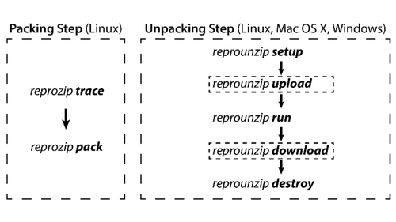
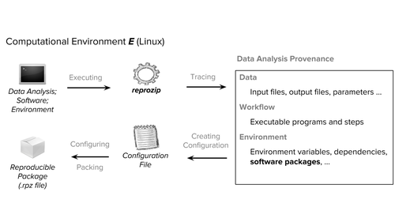
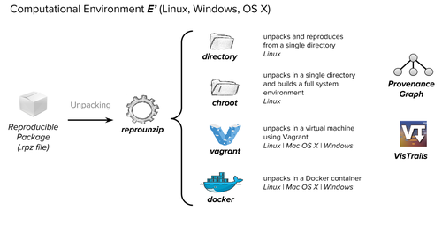

# Summary
ReproZip is a tool aimed at simplifying the process of creating reproducible experiments. After finishing an experiment, writing a website, constructing a database, or  creating an interactive environment, users can run ReproZip to create reproducible packages, archival snapshots, and an easy way for reviewers to validate their work. 
  
ReproZip was created to combat the problem of "dependency hell" -- the pit of software libraries, inputs, configuration parameters, etc. that comprise everything necessary to run and rerun applications and computational experiments. For researchers to even begin to think about sharing their work reliably and reproducibly, they have to create a compendium of all the steps and dependencies. Doing this manually is not only a huge pain, but also ridiculously difficult and prone to human error, especially if the researcher didn’t plan to do this at the beginning. 

ReproZip has two steps:

1. The packing step happens in the original environment (currently, only Linux), and generates a compendium of the experiment. ReproZip tracks operating system calls while a project is executing, and creates a package (a `.rpz` file) that contains all the binaries, files, dependencies, and all other necessary information and components for reproduction. These `.rpz` files are much smaller than a virtual machine, and quite easy to share.

2. The unpacking step reproduces the experiment from the `.rpz` file.  ReproUnzip offers different unpacking methods, from simply decompressing the files in a directory to starting a full virtual machine, and they can be used interchangeably from the same packed experiment. It is also possible to automatically replace input files and command-line arguments. Reviewers can unpack `.rpz` files on Linux, Windows, and Mac OS X, since ReproUnzip can unpack the experiment in a virtual machine (Vagrant or Docker). This step also has a graphical user interface option for users unfamiliar with the command line.

We have a [repository of examples](https://github.com/ViDA-NYU/reprozip-examples) with explicit instructions on how to reproduce a subset of use cases. This repository provides documentation, `.rpz` files, and also a Vagrantfile that automatically configures a machine with six of the eleven case studies in the examples repository.

# References
* [Archive on Zenodo](https://doi.org/10.5281/zenodo.159604); Rémi Rampin, Fernando Chirigati, Vicky Steeves, Dennis Shasha, Juliana Freire
* [Documentation](https://reprozip.readthedocs.io/en/1.0.x/); Rémi Rampin, Fernando Chirigati, Vicky Steeves
* [Main website](https://vida-nyu.github.io/reprozip/); Fernando Chirigati, Rémi Rampin, Vicky Steeves
* [Repository of examples](http://doi.org/10.17605/OSF.IO/JB2UV); Vicky Steeves, Rémi Rampin, Fernando Chirigati
* [Visual guide to examples](https://vida-nyu.github.io/reprozip-examples/); Vicky Steeves, Rémi Rampin
* [Most recent paper](https://doi.org/10.1145/2882903.2899401); Rémi Rampin, Fernando Chirigati, Dennis Shasha, Juliana Freire
* [YouTube Demo Video](https://www.youtube.com/watch?v=-zLPuwCHXo0); Fernando Chirigati, Vicky Steeves
